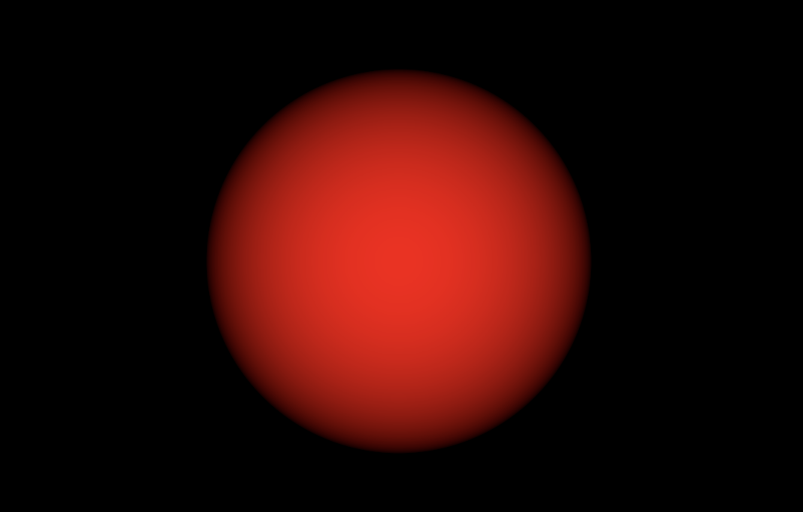
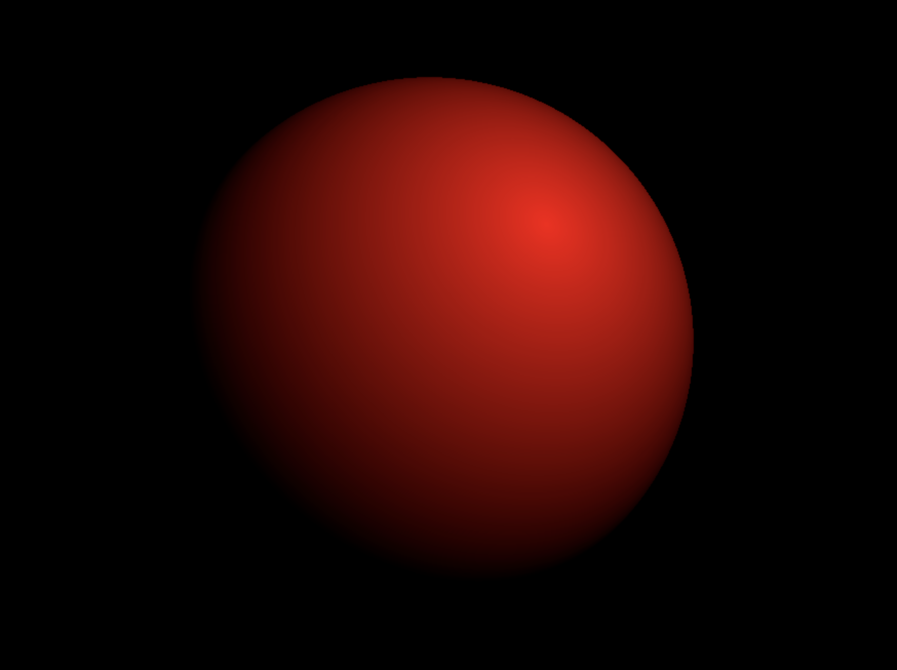
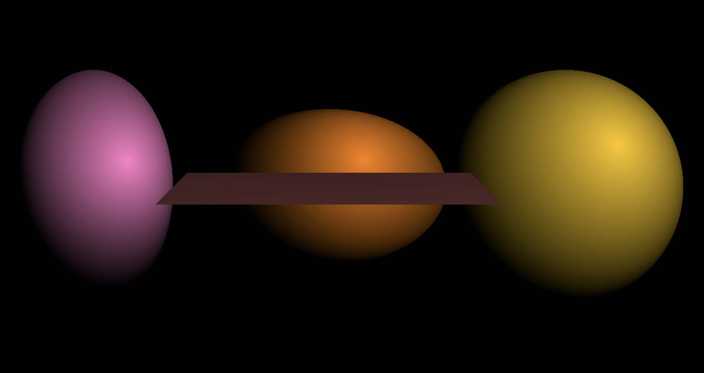
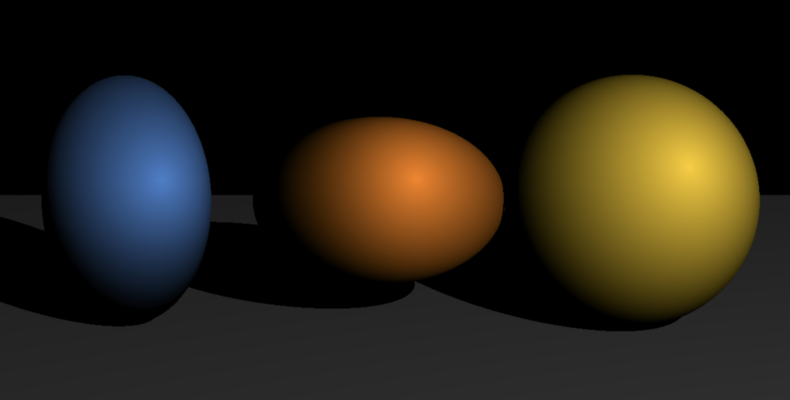
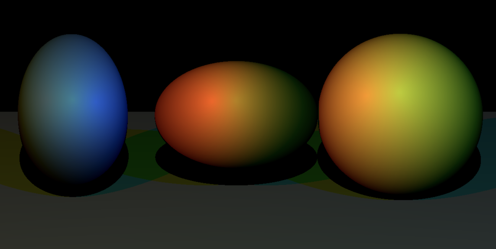
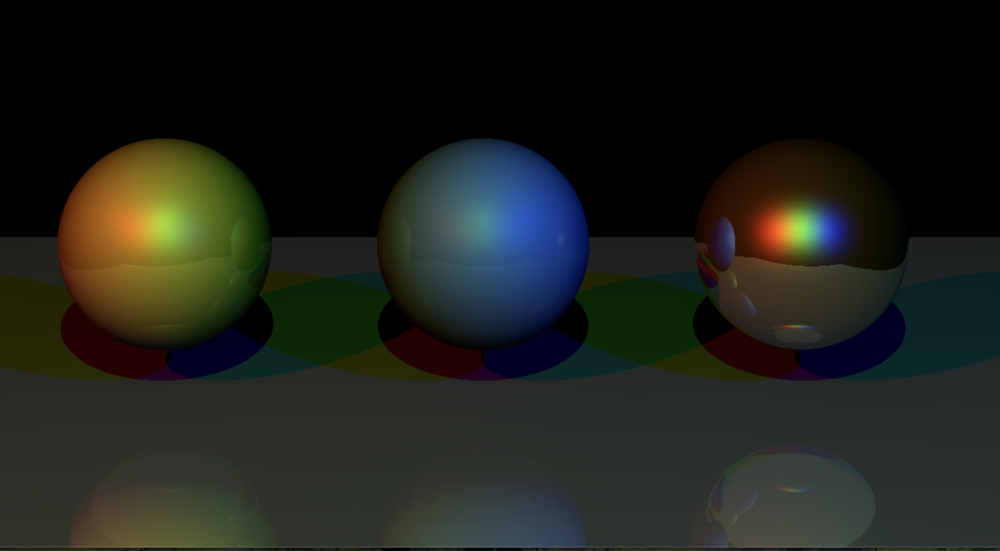
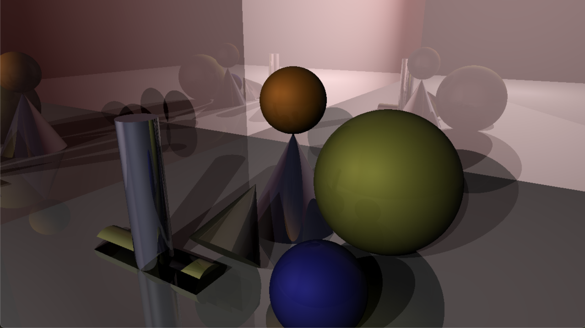
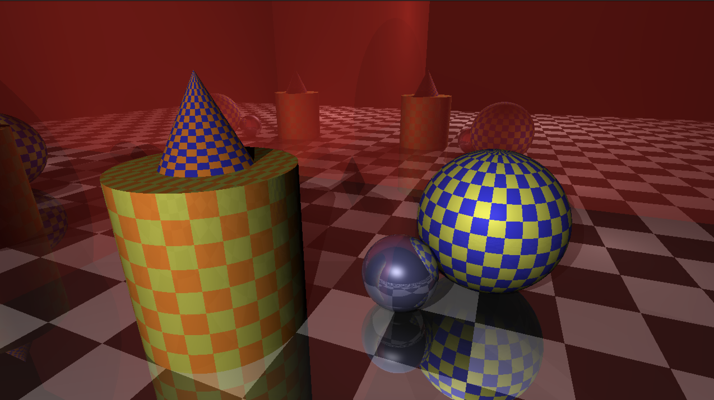

# RAY TRACER IN C++

Welcome to the Ray Tracer project! This application is a simple yet powerful demonstration of ray tracing principles, written in modern C++ using the SDL2 library. The project showcases realistic rendering of 3D scenes by simulating light rays, reflections, refractions, and shadows with high accuracy.

## About Ray Tracing

Ray tracing is a rendering technique used to generate images by tracing the path of light rays as they interact with objects in a virtual scene. It accurately models how light behaves in the real world, producing images with lifelike effects such as:

- Soft shadows
- Reflections and refractions
- Depth of field and motion blur (with advanced extensions)

The result is a high-quality image, but with increased computational cost compared to rasterization techniques.

## Progress So Far

**[21/12/2024]**

|  |  |
|----------------------------------------------|----------------------------------------------|
| Added point light source.                    | Added geometric transformations.             |

**[22/12/2024]**

|   |   |
|----------------------------------------------|----------------------------------------------|
| Added plane.                                 | Shadows                                      |

|   |   |
|----------------------------------------------|----------------------------------------------|
| Multiple lights and shadows                  | Added reflection and materials.              |

**[25/12/2024]**

|   |   |
|----------------------------------------------|----------------------------------------------|
| Added reflection and materials.              | Textures                                     |